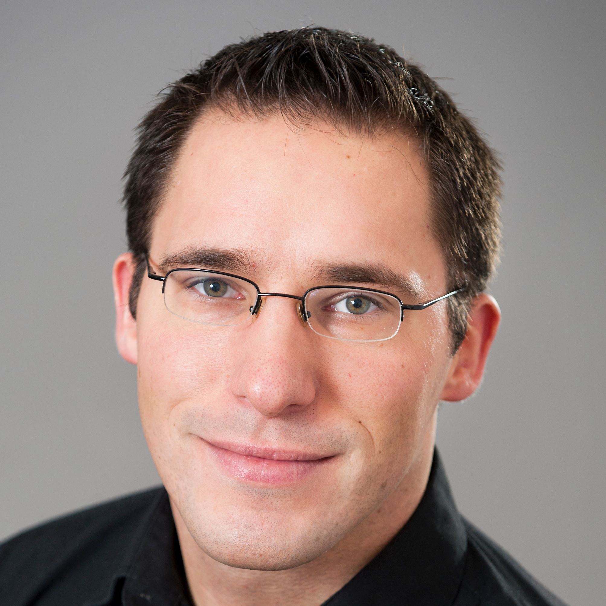

## About Me

Hi! I am a PhD candidate in Economics at the [Swedish Institute for Social Research, Stockholm University](www.sofi.su.se).

## Research Interest

My research revolves - broadly speaking - around intergenerational mobility and the inheritance of disadvantage. I am particularly interested in the underlying causal mechanisms driving intergenerational associations, with a focus on early childhood conditions and health. 

## Selected Projects:

---

